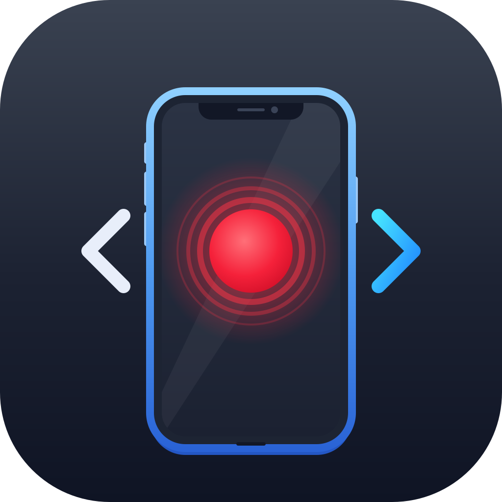
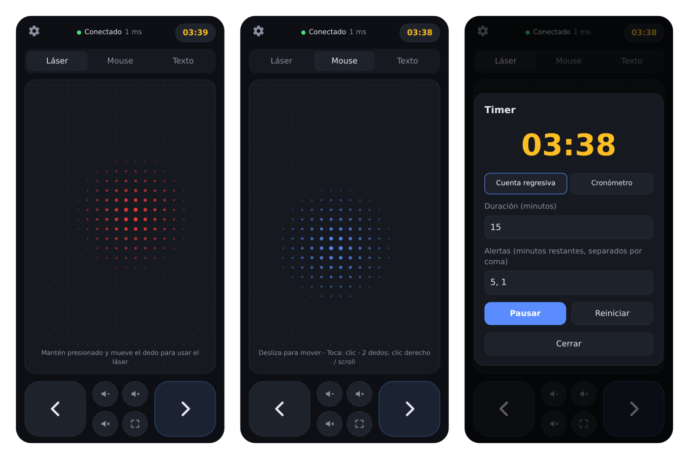

<div align="center">



# Mousecli

**Convierte tu teléfono en un control de presentaciones.**

Pasa diapositivas, usa un puntero láser, controla el volumen, mueve el mouse y dicta texto en tu PC, sin instalar nada en el teléfono.

[](https://github.com/BenjaMartinezV/Mousecli/releases/latest)
[](https://github.com/BenjaMartinezV/Mousecli/actions/workflows/ci.yml)
[](LICENSE)


[**Descargar**](https://github.com/BenjaMartinezV/Mousecli/releases/latest) · [Reportar un error](https://github.com/BenjaMartinezV/Mousecli/issues/new/choose) · [Contribuir](CONTRIBUTING.md)



</div>

---

## Tabla de contenidos

- [Características](#características)
- [Inicio rápido](#inicio-rápido)
- [Cómo funciona](#cómo-funciona)
- [Uso](#uso)
- [Compatibilidad](#compatibilidad)
- [Solución de problemas](#solución-de-problemas)
- [Seguridad](#seguridad)
- [Desarrollo](#desarrollo)
- [Hoja de ruta](#hoja-de-ruta)
- [Contribuir](#contribuir)
- [Licencia](#licencia)

## Características

| Función | Descripción |
|---|---|
| **Diapositivas** | Botones grandes para avanzar y retroceder. Funciona con PowerPoint, Google Slides, Keynote, Canva, visores de PDF y cualquier aplicación que use las flechas del teclado. |
| **Puntero láser** | Un punto rojo con estela que se dibuja sobre la presentación y se controla deslizando el dedo. No mueve el mouse real ni interfiere con la presentación. |
| **Pantalla completa** | Un botón inicia la presentación en pantalla completa desde la diapositiva actual y, al tocarlo de nuevo, sale de ella. |
| **Volumen** | Subir, bajar y silenciar. Mantener presionado repite la acción. |
| **Modo mouse** | El teléfono funciona como touchpad: deslizar mueve el cursor, tocar hace clic, tocar con dos dedos hace clic derecho y deslizar con dos dedos hace scroll. |
| **Texto y dictado** | Escribe o dicta con el micrófono del teclado del teléfono y el texto se escribe en el PC. Incluye atajos para Enter, Tab, Esc, borrar y F5. |
| **Timer configurable** | Cuenta regresiva o cronómetro, con alertas en los minutos que elijas. Vibra y cambia de color (verde, amarillo, rojo) a medida que se acaba el tiempo. |
| **Multi-pantalla** | El láser se muestra por defecto en la pantalla secundaria (proyector), con opción de cambiarla desde el teléfono. |

## Inicio rápido

1. Descarga el archivo para tu sistema desde la [última versión](https://github.com/BenjaMartinezV/Mousecli/releases/latest):

   | Sistema | Archivo |
   |---|---|
   | Windows 10 y 11 | `Mousecli-vX.Y.Z-windows.zip` |
   | macOS 12 o superior | `Mousecli-vX.Y.Z-macos.zip` |
   | Linux | `Mousecli-vX.Y.Z-linux.zip` |

2. Descomprime el archivo y abre **Mousecli**. Aparecerá una ventana con un código QR.
3. Conecta el teléfono a la misma red WiFi que el PC y escanea el QR con la cámara.

No es necesario instalar Python ni usar la terminal.

> **Primera ejecución.** Como la aplicación no está firmada digitalmente, el sistema puede mostrar una advertencia:
>
> - **Windows:** si aparece "Windows protegió su PC", haz clic en *Más información* y luego en *Ejecutar de todas formas*. Si el firewall pregunta, permite el acceso en **redes privadas**.
> - **macOS:** haz clic derecho sobre la aplicación, elige *Abrir* y confirma. Luego autoriza Mousecli en *Ajustes del Sistema > Privacidad y seguridad > Accesibilidad*.
> - **Linux:** si el archivo no se abre, dale permisos de ejecución con `chmod +x Mousecli`.

<details>
<summary><b>Instalación con Python (para usuarios avanzados)</b></summary>

Requiere Python 3.9 o superior.

```bash
pipx install git+https://github.com/BenjaMartinezV/Mousecli.git
mousecli
```

</details>

## Cómo funciona

```
 Teléfono (navegador)                      PC
 ┌───────────────────┐   WebSocket    ┌─────────────────────────────┐
 │   Web app         │ ─────────────> │  Mousecli                   │
 │   (sin instalar)  │   WiFi local   │   - simula teclado y mouse  │
 └───────────────────┘                │   - dibuja el puntero láser │
                                      └─────────────────────────────┘
```

Mousecli ejecuta un pequeño servidor en el PC que también entrega la web app del teléfono. Al escanear el QR, el teléfono abre una conexión WebSocket persistente sobre la red local, con una latencia típica de 5 a 20 ms. El movimiento del dedo se agrupa y se envía como máximo una vez por cuadro de pantalla, lo que mantiene el láser fluido sin saturar la red.

No se usa internet ni servicios externos: todo ocurre entre el teléfono y el PC.

## Uso

### En una presentación

1. Conecta el proyector y abre la presentación en el PC. Haz clic una vez sobre ella para que tenga el foco del teclado.
2. Usa el teléfono:
   - El botón de pantalla completa inicia la presentación desde la diapositiva actual. Tócalo de nuevo para salir.
   - Los botones grandes pasan las diapositivas.
   - Mantén el dedo sobre el panel central para mostrar el láser y muévelo.
   - Los otros botones pequeños controlan el volumen.
   - El reloj de la esquina superior abre el timer.

El botón de pantalla completa usa el atajo de PowerPoint y LibreOffice Impress (`Shift+F5`, o `Cmd+Enter` en macOS). En otras aplicaciones, como Google Slides o Keynote, inicia la presentación desde el PC y usa el teléfono para todo lo demás.

Para que el teléfono abra Mousecli como una aplicación, usa *Agregar a pantalla de inicio* en el menú del navegador.

### Ajustes

Desde el engranaje de la web app puedes ajustar la sensibilidad del láser y del mouse, el tamaño del láser, la vibración de los botones y la pantalla donde aparece el láser.

### Opciones de línea de comandos

| Opción | Descripción |
|---|---|
| `--port N` | Puerto del servidor (por defecto `8765`). |
| `--host IP` | IP que se muestra en el QR, útil si el PC tiene varias redes. |
| `--no-gui` | Ejecuta sin ventana ni puntero láser, solo en la terminal. |
| `--new-token` | Genera un token nuevo. Los teléfonos guardados tendrán que escanear el QR otra vez. |
| `-v`, `--verbose` | Muestra información de depuración. |

## Compatibilidad

| Función | Windows | macOS | Linux (X11) | Linux (Wayland) |
|---|---|---|---|---|
| Diapositivas, texto y mouse | Sí | Sí | Sí | Limitado |
| Volumen | Sí | Sí | Sí | Sí |
| Puntero láser | Sí | Sí | Sí | Limitado |

En el teléfono funciona con cualquier navegador moderno: Chrome, Safari, Firefox, Edge o Samsung Internet.

**macOS:** el láser no se muestra sobre presentaciones en un Espacio de pantalla completa nativo. Usa la opción "Reproducir en ventana" de Keynote o el modo ventana de PowerPoint.

**Linux con Wayland:** por diseño de seguridad, Wayland restringe la simulación de teclado y las ventanas superpuestas. Se recomienda iniciar sesión en X11.

**WSL:** Mousecli debe ejecutarse en Windows, no dentro de WSL, ya que desde WSL no es posible controlar el teclado ni el mouse de Windows.

## Solución de problemas

**El teléfono no se conecta.**
- Verifica que el teléfono y el PC estén en la misma red WiFi.
- En Windows, la red debe estar configurada como **privada** (*Configuración > Red e Internet > Propiedades*).
- Muchas redes de universidades, empresas y hoteles bloquean la comunicación entre dispositivos. En ese caso, activa el hotspot del teléfono y conecta el PC a él. Es la opción más confiable.
- Si el PC tiene varias interfaces de red (VPN, máquinas virtuales), indica la IP correcta con `--host`.

**Los botones no hacen nada en la presentación.**
La ventana de la presentación debe tener el foco. Haz clic sobre ella una vez.

**Aparece "No se pudo abrir el puerto".**
Mousecli ya está abierto. Búscalo en la barra de tareas.

**La pantalla del teléfono se apaga.**
Los navegadores solo permiten mantener la pantalla encendida en conexiones HTTPS. Aumenta el tiempo de apagado de pantalla del teléfono durante la presentación. Mousecli se reconecta automáticamente al volver.

**El láser aparece en la pantalla equivocada.**
Abre *Ajustes* en el teléfono y presiona *Cambiar* en "Pantalla del láser".

**Registro de errores.**
La aplicación guarda un registro en `mousecli.log`, ubicado en `%APPDATA%\Mousecli` (Windows), `~/Library/Application Support/Mousecli` (macOS) o `~/.config/mousecli` (Linux). Adjúntalo al [reportar un error](https://github.com/BenjaMartinezV/Mousecli/issues/new/choose).

## Seguridad

- El servidor solo es accesible desde la red local y no usa servicios externos.
- Cada instalación genera un token privado que va incluido en el QR. Solo los dispositivos que lo escanean pueden conectarse.
- Si se desconecta el teléfono, el láser se oculta automáticamente.

Consulta [SECURITY.md](SECURITY.md) para más detalles y para reportar vulnerabilidades.

## Desarrollo

```bash
git clone https://github.com/BenjaMartinezV/Mousecli.git
cd Mousecli
pip install -e ".[dev]"
mousecli -v
```

Consulta [CONTRIBUTING.md](CONTRIBUTING.md) para la guía completa.

### Estructura del proyecto

```
src/mousecli/
├── cli.py          Punto de entrada: argumentos, token, QR y arranque
├── server.py       Servidor HTTP + WebSocket (aiohttp)
├── actions.py      Teclado, mouse y volumen (pynput)
├── gui.py          Capa transparente del láser y ventana del QR (PyQt6)
└── web/            Web app del teléfono (HTML, CSS y JavaScript sin dependencias)
scripts/
├── build.py        Compila la aplicación y genera el .zip para el sistema actual
└── make_icons.py   Genera los íconos PNG e ICO a partir de icon.svg
tests/              Tests del servidor y la configuración (pytest)
```

### Protocolo

El teléfono envía mensajes JSON cortos por WebSocket (`/ws?token=...`).

| Mensaje | Acción |
|---|---|
| `{"t":"key","k":"next"}` | Tecla con nombre: `next`, `prev`, `present` (pantalla completa), `end`, `start`, `enter`, `backspace`, `tab`, `esc`, `space` |
| `{"t":"vol","a":"up"}` | Volumen: `up`, `down`, `mute` |
| `{"t":"laser","on":true}` | Mostrar u ocultar el láser |
| `{"t":"lm","x":3.5,"y":-1}` | Mover el láser (relativo, en píxeles) |
| `{"t":"mm","x":4,"y":2}` | Mover el mouse (relativo, en píxeles) |
| `{"t":"click","b":"left"}` | Clic: `left` o `right` |
| `{"t":"scroll","y":-1}` | Scroll vertical, en pasos |
| `{"t":"type","s":"hola"}` | Escribir texto |
| `{"t":"cfg","size":14}` | Tamaño del láser |
| `{"t":"cfg","screen":"next"}` | Cambiar la pantalla del láser |
| `{"t":"ping","id":123}` | Medición de latencia |

El servidor responde con `hello` al conectar (versión y capacidades disponibles), `pong` y `screen` (nombre de la pantalla seleccionada).

### Compilar la aplicación

```bash
pip install . pyinstaller pillow
python scripts/build.py
```

El resultado queda en `dist/`. Al publicar un tag `v*`, GitHub Actions compila las versiones para Windows, macOS y Linux y las adjunta automáticamente al release.

## Hoja de ruta

- [x] Pasar diapositivas y conexión por QR
- [x] Puntero láser, pantalla completa, volumen y timer configurable
- [x] Modo mouse y dictado de texto
- [x] Aplicaciones descargables para Windows, macOS y Linux
- [ ] Lápiz y resaltador sobre la presentación
- [ ] Notas del orador y miniatura de la siguiente diapositiva
- [ ] Ícono en la bandeja del sistema
- [ ] Publicación en PyPI

## Contribuir

Las contribuciones son bienvenidas. Lee la [guía de contribución](CONTRIBUTING.md) antes de abrir un Pull Request. Para reportar errores o proponer mejoras, usa las [plantillas de issues](https://github.com/BenjaMartinezV/Mousecli/issues/new/choose).

## Licencia

Distribuido bajo la licencia MIT. Consulta [LICENSE](LICENSE) para más información.
